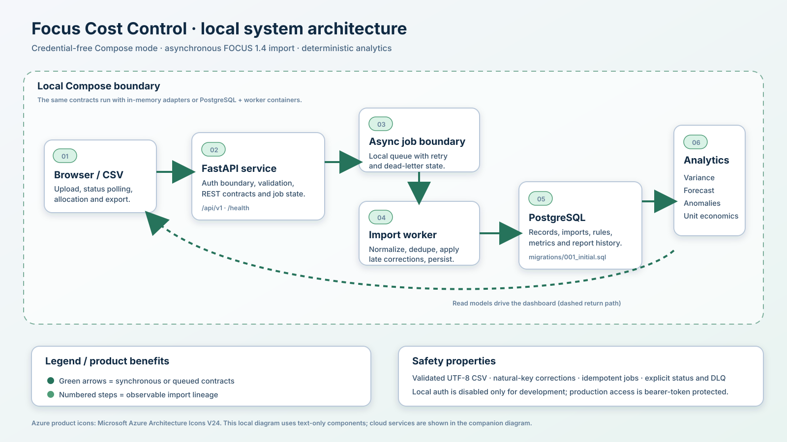
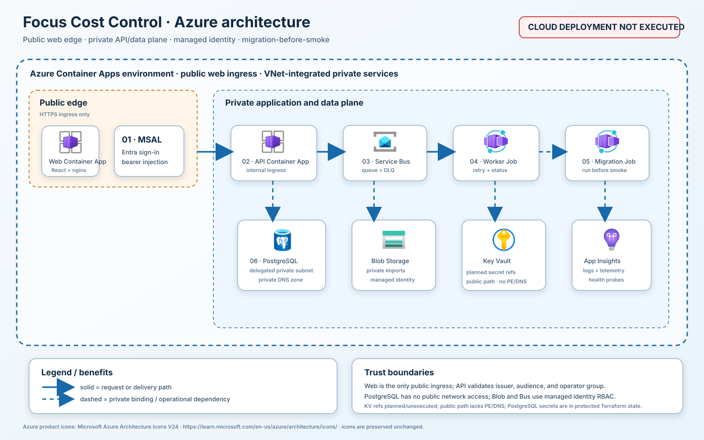
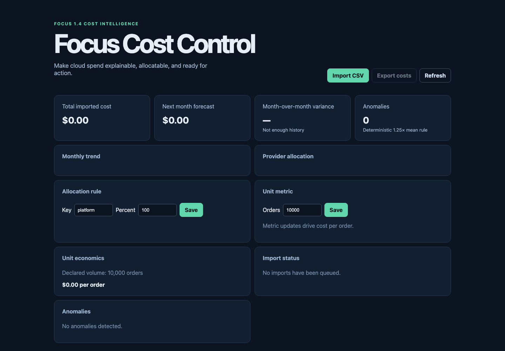

# Focus Cost Control

## Purpose and usefulness

Focus Cost Control turns a validated subset of the FOCUS 1.4 billing format
into explainable cost records, allocation results, deterministic forecasts,
anomaly signals, and unit economics. It is useful when finance, platform, and
product teams need a repeatable local workflow for importing CSV exports,
checking lineage and retries, and reviewing cost drivers without opaque
financial advice.

## Capabilities

- Validates UTF-8 FOCUS CSV files, required columns, dates, currency, amounts,
  file size, natural keys, duplicates, and late corrections.
- Persists imports, normalized costs, allocation rules, unit metrics, and report
  snapshots through an in-memory adapter or PostgreSQL.
- Processes imports asynchronously with retry and dead-letter states.
- Exposes versioned REST endpoints for imports, costs, allocations, forecasts,
  variance, anomalies, unit economics, status, and CSV export.
- Provides an accessible responsive dashboard for upload, polling, analytics,
  rule editing, metric input, and export.

## Architecture





The local path is FastAPI plus a worker and either in-memory storage or the
Compose PostgreSQL migration. The planned Azure path uses a public web edge,
internal API, queue worker and migration Job, private PostgreSQL, private Blob
and Service Bus endpoints, Entra authentication, managed identities, and
Application Insights. The cloud diagram is a design review artifact, not
deployment evidence.

## Local operation and evidence

```sh
python3 -m venv .venv
.venv/bin/pip install -e '.[test]'
PYTHONPATH=src .venv/bin/pytest -q
docker compose up --build
```

Open `http://127.0.0.1:5173` in local auth-disabled mode. The synthetic
fixture is [`fixtures/sample.csv`](fixtures/sample.csv). The dashboard capture
below is a genuine headless-Chrome capture of the isolated local Compose
dashboard; it contains synthetic zero-state data only.



*Local mode, auth disabled; captured from the checked-in dashboard bundle via
the isolated Compose stack on 2026-08-16. This is local UI evidence, not cloud
deployment evidence.*

The repeatable local drill is `./scripts/e2e.sh`. Relevant checks are also
gated in CI: Python tests/compilation, dashboard install/typecheck/build/test,
Terraform formatting/init/validation, Gitleaks, Trivy filesystem scanning,
and the image build/security gate.

### Dated local evidence

On 2026-08-16, Python tests passed (`13 passed`), `compileall` passed, and the
package/version contract reported `1.0.0`. Dashboard typecheck, build, and one
contract test passed as local checks; `npm audit` reported 0 vulnerabilities.
`docker compose config --quiet` passed. The isolated lifecycle under
`COMPOSE_PROJECT_NAME=focuse2e20260816` passed Compose build/migration/import,
API restart persistence, importer retry/DLQ (`5 passed`), and the Playwright
browser flow (`1 passed`) covering upload/status, allocation, unit metric,
analytics, export, and DLQ; its stack and volume cleanup exited 0. Terraform
formatting, offline initialization, and validation passed with the available
provider cache. The genuine screenshot above was captured from the isolated
local Compose dashboard. These are local checks only; current expanded hosted
CI evidence awaits its PR run.

## Planned Azure deployment method

**Deployment status:** Azure resources are planned but not deployed; local/CI evidence is not deployment evidence.

Deployment is a protected GitHub OIDC workflow using an operator-owned Azure
subscription and protected environment inputs:

1. **PLAN** — provide the protected Azure identity, subscription, region,
   immutable API/UI image digests, Entra identifiers, PostgreSQL password, and
   remote state coordinates; the workflow sets `TF_VAR_enable_apply=true` to
   evaluate the real graph while making no mutation, then review the plan.
2. **APPLY** — after environment approval and explicit cost approval, run
   Terraform with `enable_apply=true`. This creates the planned resource graph
   and outputs the web URL and resource identifiers.
3. **MIGRATION** — run the one-shot migration Job and verify its completion
   before accepting application traffic.
4. **SMOKE** — obtain the output-derived web URL, authenticate through Entra,
   import only the synthetic fixture, verify polling/dedupe/analytics,
   and retain sanitized evidence.
5. **DESTROY** — after the acceptance window, require a separate protected
   confirmation, destroy the temporary graph, and verify the resource group is
   absent. Never destroy shared state or production data.

The exact inputs, owners, exit criteria, rollback, and destroy warning are in
[`docs/runbooks/azure.md`](docs/runbooks/azure.md). No step has been executed
against Azure in this repository.

## Limitations and pre-deployment blockers

The FOCUS implementation is a bounded practical subset. Forecasts, anomalies,
allocation, and unit economics are deterministic operational heuristics, not
financial, accounting, or security advice. Local authentication is disabled
for development only. The current Terraform design leaves Key Vault on a
public network path that remains authentication/RBAC protected; it does not
set `public_network_access_enabled` and does not create a Key Vault private
endpoint or private DNS zone. This is an unexecuted network-hardening risk,
not anonymous access. The PostgreSQL administrator password and connection
string are represented in Terraform state, so protected encrypted,
least-privilege, access-logged remote state is mandatory.

Before deployment, close the following blockers: Key Vault private endpoint and
DNS design; encrypted versioned remote state with least-privilege access and
audit logs; budgets, alerts, and resource tags; retention policies; recovery
and restore validation; malware scanning and tenant authorization; and a
reviewed rollback plan. Required data-protection targets are raw imports 30
days, normalized cost/report records 90 days, and audit/telemetry 30 days.
Target RPO is at most 24 hours and target RTO at most 4 hours. A restore drill
is required before first deployment and at least quarterly thereafter; these
are requirements, not completed evidence.

The bounded cost envelope is a pre-deployment gate owned by the platform owner
and budget owner, with evidence held by the release operator. Record the
current Azure Pricing Calculator estimate and obtain approval under the
pre-approved budget threshold before PLAN/APPLY. Use the exact Terraform SKUs
and resource counts in the reviewed plan, a default acceptance window of at
most two hours, and a named owner/escalation contact. If the window is missed,
escalate and use the DESTROY gate rather than leaving resources running.

See [`SECURITY.md`](SECURITY.md), [`docs/threat-model.md`](docs/threat-model.md),
and [`docs/evidence-matrix.md`](docs/evidence-matrix.md) for security and
evidence boundaries.

MIT licensed.
