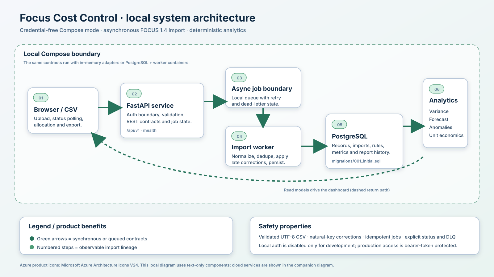
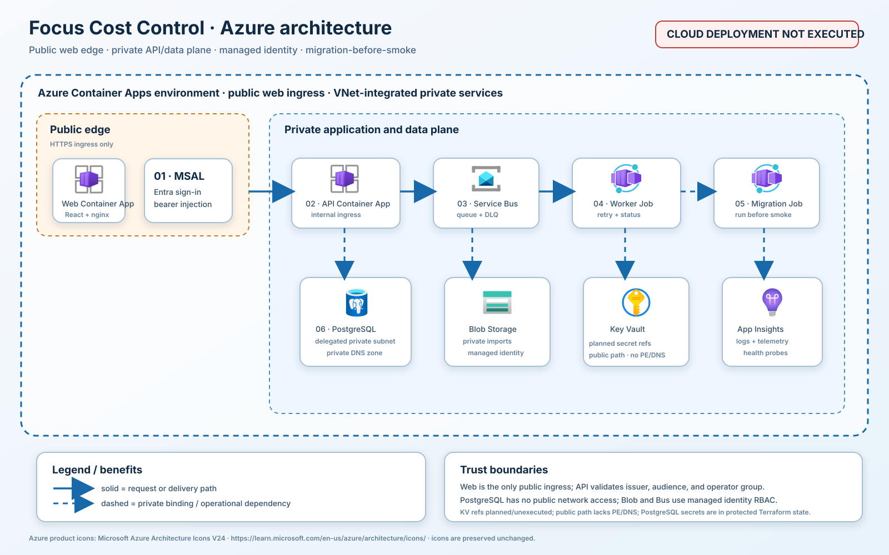
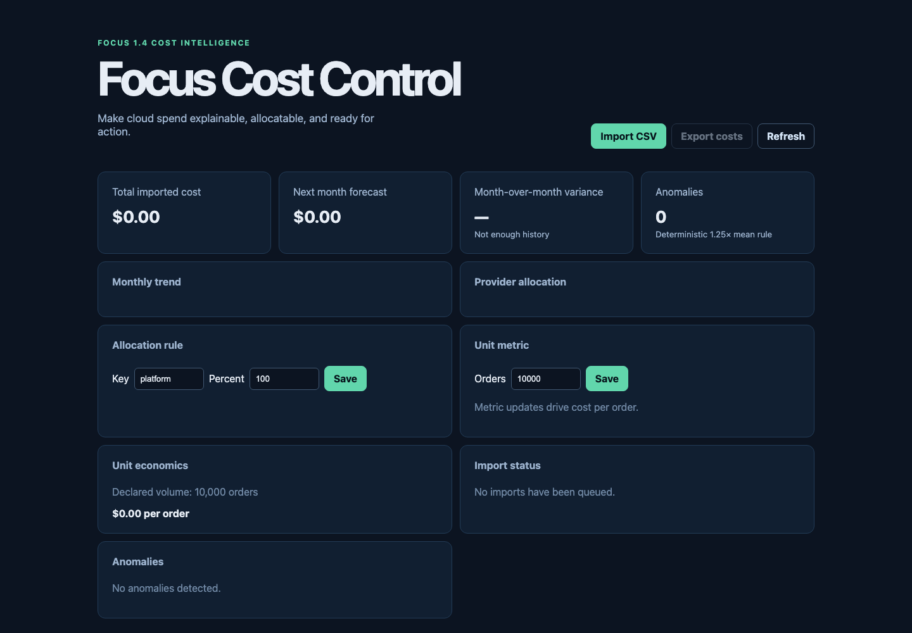

<!-- reader-first-readme:v1 -->

# Focus Cost Control

Focus Cost Control helps finance, platform, and product teams turn cloud billing exports into costs they can explain and act on. It validates each import, preserves where every record came from, allocates shared spending, highlights changes and unusual values, and connects cost to product activity through one review dashboard.

Its calculations are deliberately deterministic: the same approved data and rules produce the same result, so a reviewer can trace an answer instead of trusting an opaque financial recommendation.

## The 30-second overview

Imagine a platform team reviewing this month's cloud bill:

1. An operator uploads a CSV billing export in the FinOps Open Cost and Usage Specification (FOCUS) format.
2. The service checks the file, rejects malformed or duplicate records, and processes valid rows in the background.
3. The dashboard explains total cost, service and account breakdowns, forecast, variance, and unusual changes.
4. The operator adds allocation rules to assign shared costs to teams or products.
5. A product metric—such as active customers—turns the result into unit cost.
6. The team exports a dated report snapshot whose inputs and rules remain traceable.
7. A corrected late-arriving billing row updates the matching natural record rather than creating misleading duplication.

The included sample contains synthetic data, and the complete workflow can run locally without cloud credentials.

## What people can do

- Import a validated practical subset of FOCUS 1.4 CSV billing data.
- Follow import progress and inspect retry or dead-letter states when processing fails.
- Browse normalized costs by provider, service, account, region, and time.
- Create allocation rules for assigning shared cost.
- Record unit metrics and calculate measures such as cost per customer.
- Compare periods, calculate deterministic forecasts, and identify anomaly signals.
- Export reproducible CSV reports.
- Use an in-memory quick path or a durable PostgreSQL environment.

These capabilities are useful when teams need a shared cost conversation backed by visible data lineage and repeatable rules.

## A representative cost-review journey

An operator uploads `fixtures/sample.csv`. The API checks that it is valid UTF-8 text, within the size limit, has the required FOCUS columns, and contains acceptable dates, currencies, and amounts. It assigns the work to a background importer so the browser can poll progress rather than wait on one long request.

The importer normalizes each row and uses a natural key—the fields that identify the real billing record—to recognize duplicates and later corrections. The operator reviews totals and cost drivers, then creates an allocation rule for a shared service. After entering a product activity metric, the dashboard calculates unit economics and presents forecast, variance, and anomaly views. The report export reflects the stored import, rule, and metric versions.

If processing repeatedly fails, the import moves to a dead-letter state: a visible holding state for work that needs investigation. The operator can examine and deliberately retry it instead of losing the failure.

## Security choices and financial boundaries

- Forecasts, anomalies, allocations, and unit economics are transparent operational heuristics, not financial or accounting advice.
- Import validation rejects unexpected encodings, columns, values, sizes, and duplicate natural keys.
- Local authentication is visibly disabled and intended only for development on the operator's computer.
- Planned cloud mode verifies Microsoft Entra ID tokens and membership in an approved operator group.
- The public web component cannot directly reach the private database, queue, or storage services.
- Managed identities are planned for service-to-service access rather than embedded cloud credentials.
- Source imports, normalized records, allocation rules, metrics, and report snapshots remain separate so results can be traced.
- Synthetic fixture data is provided; the repository does not contain real billing exports.

## System architecture: from billing file to report



In plain language:

1. The React dashboard sends the CSV file to the FastAPI application programming interface (API).
2. The API validates and records the import, then places background work in a queue.
3. A separate worker imports, deduplicates, and normalizes the cost rows.
4. An in-memory repository supports the smallest local mode; Docker Compose uses PostgreSQL and a migration to demonstrate durable storage.
5. Analytics functions read the normalized records, allocation rules, and unit metrics to build explainable results.
6. The dashboard polls status, lets the operator edit inputs, and presents or exports the resulting report.

## Technology guide in plain English

| Technology | Its job in this project |
| --- | --- |
| FOCUS 1.4 | Defines common names and meanings for cloud billing columns across providers; this project implements a documented practical subset. |
| Python | Implements import validation, cost rules, analytics, and background processing. |
| FastAPI | Runs the HTTP API used by the dashboard. |
| React | Builds the browser-based cost review dashboard. |
| PostgreSQL | Stores imports, normalized costs, rules, metrics, job state, and report snapshots durably. |
| Docker Compose | Starts the local database, migration, API, worker, and dashboard as one environment. |
| Terraform | Describes the planned Azure environment as reviewable code. |
| Microsoft Entra ID | Would prove cloud users' identities and operator-group membership. |
| GitHub Actions | Repeats tests and provides protected, manually dispatched Azure gates. |

## Azure cloud resources architecture

The cloud design separates the public dashboard from the internal data-processing services.



The diagram uses unchanged [official Microsoft Azure Architecture Icons](https://learn.microsoft.com/en-us/azure/architecture/icons/), version V24. Preserved source files and embedding details are recorded in [the diagram notes](docs/diagrams/README.md).

The public Azure Container App serves the website and proxies authorized requests to an internal API Container App. Microsoft Entra ID supplies the identity token. Blob Storage holds imports, Service Bus carries background jobs, and a Container Apps Job performs imports. Azure Database for PostgreSQL stores durable cost records. Private endpoints and a virtual network isolate storage, messaging, and database traffic. Managed identities authorize services, Key Vault represents protected configuration, and Application Insights collects operational signals.

### Deployment status

The planned Azure resources have not been deployed. Terraform formatting, offline initialization, validation, and contract tests check the design but do not prove that it works in an Azure subscription. The Key Vault public-network path, protected state configuration, identity integration, recovery, and the end-to-end cloud lifecycle remain acceptance blockers described below.

## What was tested

Recorded local evidence includes:

- Thirteen Python tests covering imports, API behavior, authentication contracts, persistence, and deployment contracts.
- Python compilation and the package/version contract.
- Dashboard type checking, production build, contract test, and dependency audit.
- A clean Docker Compose lifecycle covering migration, import, API restart persistence, retry/dead-letter behavior, and cleanup.
- A Playwright browser journey covering upload and status, allocations, unit metrics, analytics, export, and failed imports.
- Docker Compose configuration validation.
- Terraform formatting, offline initialization, and validation without an Azure apply.
- Continuous-integration gates for source, dashboard, infrastructure, secret scanning, vulnerabilities, image builds, and software bills of materials.

The [evidence matrix](docs/evidence-matrix.md) links each capability to its dated evidence and boundary.

## Important limitations

- The importer supports a practical subset of FOCUS 1.4, not every optional column or provider extension.
- Cost calculations are deterministic heuristics and do not replace finance, tax, procurement, or accounting review.
- The local in-memory path loses its state when stopped; use the Compose PostgreSQL path to test persistence.
- Local auth-disabled mode must not be exposed beyond a trusted development machine.
- The Azure design has not been applied or smoke-tested. Subscription permissions, quotas, networking, service behavior, cost, and cleanup are unverified.
- Key Vault is still on a public network path protected by authentication and role-based access; a private endpoint and private DNS design remain required before deployment.
- PostgreSQL credentials and connection information would appear in Terraform state, making encrypted, versioned, least-privilege remote state mandatory.
- Malware scanning, tenant authorization, budgets, alerts, retention automation, and recovery evidence are not complete.
- Retention periods and recovery targets in the runbook are requirements, not demonstrated outcomes.

## Running the project locally

This section is for someone who wants to operate the service. A non-technical reader can stop here without missing the product explanation.

### Before you begin

The complete path needs Docker with Docker Compose. The direct test path needs Python 3.11 or later. No cloud credentials are needed.

### 1. Start the complete environment

From the repository folder:

```sh
docker compose up --build
```

Open `http://127.0.0.1:5173`. The `AUTH DISABLED` label is expected in local mode.



### 2. Try the representative workflow

Upload [`fixtures/sample.csv`](fixtures/sample.csv), wait for its successful status, review the analytics, add an allocation rule and unit metric, then export a report. All fixture values are synthetic.

For the repeatable automated lifecycle—including persistence, retry/dead-letter behavior, the browser flow, and cleanup—run:

```sh
./scripts/e2e.sh
```

### 3. Stop the environment

Press `Ctrl+C`, then run:

```sh
docker compose down
```

Removing volumes permanently deletes the local PostgreSQL data; do so only when that is intended.

## Checking the project

The source and dashboard checks use Python 3.11 or later and Node.js 22:

```sh
python3 -m venv .venv
.venv/bin/pip install -e '.[test]'
PYTHONPATH=src .venv/bin/pytest -q
PYTHONPATH=src .venv/bin/python -m compileall -q src

cd web
npm ci
npm run check
npm test
npm run build
cd ..

docker compose config --quiet
terraform -chdir=infra/azure fmt -check
terraform -chdir=infra/azure init -backend=false -input=false
terraform -chdir=infra/azure validate
```

## How to deploy using the protected Azure workflows

Deployment uses separate manually dispatched GitHub Actions workflows with GitHub's identity connection to an operator-owned Azure subscription. Before starting, configure immutable API and website image digests, Microsoft Entra identifiers, the database password, protected remote-state coordinates, a budget and acceptance owner, and the required Azure identity values. Review the [Azure runbook](docs/runbooks/azure.md), [security guidance](SECURITY.md), [threat model](docs/threat-model.md), and [cost model](docs/cost-model.md).

Run the gates in this order:

1. Dispatch **Azure plan** with `PLAN-ONLY`; review resources, permissions, networking, state exposure, and the current price estimate.
2. After the documented security blockers are closed and owners approve, dispatch **Azure apply** with `APPLY-APPROVED` to create the environment and run its one-shot database migration job.
3. Dispatch **Azure smoke** with `SMOKE-APPROVED`; sign in with a fictional operator and verify the synthetic import, deduplication, allocation, analytics, and unit economics at the output-derived web address.
4. Within the approved acceptance window, dispatch **Azure destroy** with `DESTROY-APPROVED`, then verify that the resource group is absent.

A failed apply or migration stops acceptance. Preserve sanitized evidence and use a reviewed Terraform rollback or destroy decision; never improvise cloud changes or manually edit state. Destruction can permanently delete imported data and must never target shared or production resources. Exact inputs, owners, evidence, exit criteria, recovery requirements, and warnings are in the [runbook](docs/runbooks/azure.md).

## Repository map

| Location | Contents |
| --- | --- |
| `src/focus_cost` | Import validation, domain rules, repositories, jobs, analytics, API, and cloud adapters. |
| `tests` | API, importer, persistence, and deployment-contract checks. |
| `web` | React dashboard, proxy configuration, component tests, and browser tests. |
| `migrations` | PostgreSQL schema used by local and cloud environments. |
| `infra/azure` | Terraform definition of the planned Azure resources. |
| `fixtures` | Synthetic FOCUS-format data for the local journey. |
| `docs/diagrams` | System and cloud diagrams plus official Azure icon sources. |
| `docs/runbooks` | Local and Azure operating procedures. |
| `scripts` | Migration and complete local lifecycle automation. |
| `.github/workflows` | CI, security, container, and protected Azure workflows. |

More detail is available in the [API reference](docs/api.md), [development guide](docs/development.md), [requirements](docs/requirements.md), and [architecture decision](docs/adr/0001-local-first-boundary.md).

Licensed under the MIT License.
